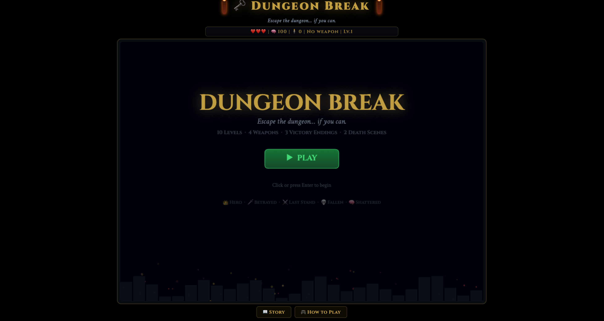
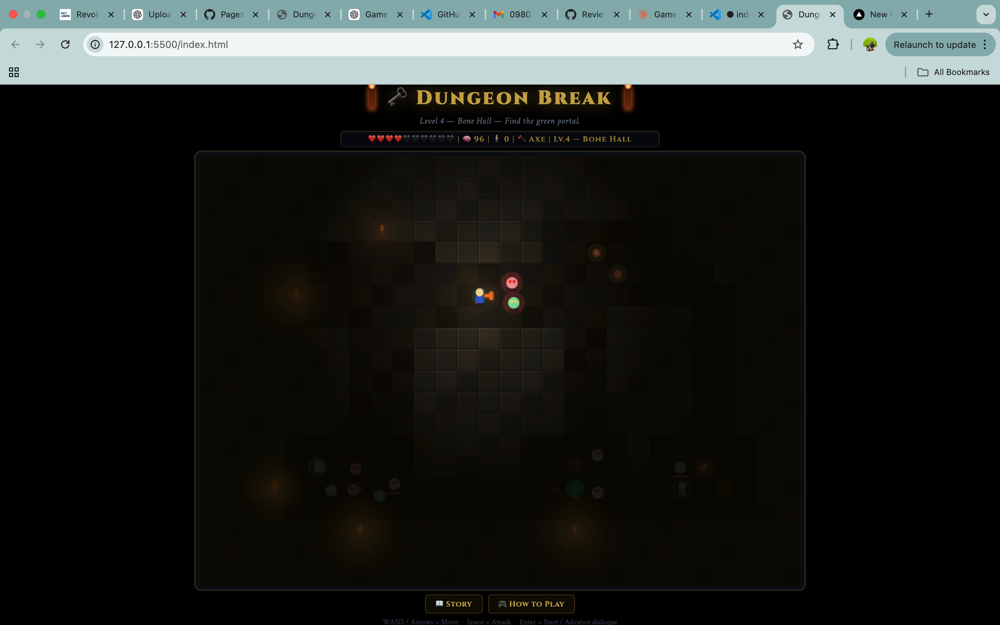
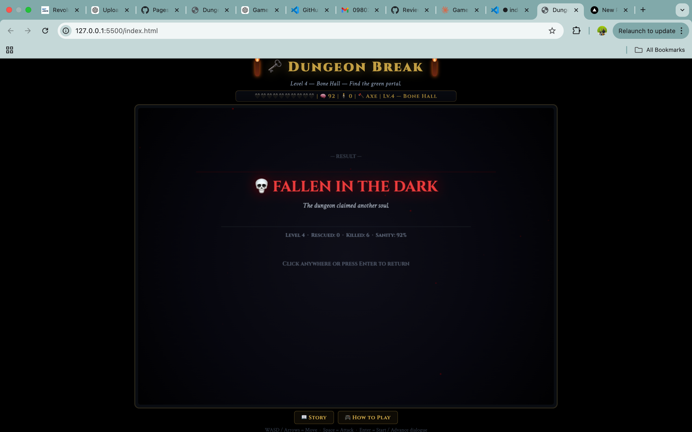

# 🗝️ Dungeon Break

<p align="center">
  <b>Escape the dungeon… if you can.</b><br/>
  <sub>Procedural HTML5 dungeon crawler built with pure JavaScript</sub>
</p>

<p align="center">


</p>

<p align="center">
  <a href="https://pdineshsampathram-spec.github.io/dungeon-break/"><b>▶ Play Live</b></a>
  &nbsp;&nbsp;•&nbsp;&nbsp;
  <a href="https://github.com/pdineshsampathram-spec/dungeon-break"><b>View Source</b></a>
</p>

---

## 🎮 Overview

**Dungeon Break** is a fast-paced top-down dungeon crawler focused on tight combat, procedural level generation, and cinematic outcomes.

Navigate dangerous dungeons, manage your sanity, rescue survivors, and uncover your fate across multiple endings.

---


## 📸 Screenshots

<p align="center">
  
  
  
</p>

---

## ✨ Key Features

- ⚔️ Four distinct weapons  
- 🧠 Sanity system that affects survival  
- 🧍 Survivor rescue mechanics  
- 👹 Multiple enemy types with AI  
- 🪤 Dynamic traps and hazards  
- 🌌 Procedurally generated levels  
- 🎬 Multiple cinematic endings  
- 📱 Responsive canvas scaling  
- 🚀 Pure vanilla JavaScript (no frameworks)

---

## 🕹️ Controls

| Action | Key |
|--------|-----|
| Move | WASD / Arrow Keys |
| Attack | Space |
| Start / Advance | Enter |

---

## 🎯 Objective

- Defeat enemies to restore sanity  
- Rescue survivors  
- Collect weapons and power-ups  
- Find the **green portal ✦**  
- Survive all **10 levels**

---

## 🛠️ Tech Stack

- HTML5 Canvas  
- Vanilla JavaScript  
- CSS3 Animations  
- Procedural Generation  

**No frameworks. No game engine.**

---

## 🚀 Run Locally

```bash
git clone https://github.com/pdineshsampathram-spec/dungeon-break.git
cd dungeon-break

---
## 📱 Mobile Support


> ⚠️ **Desktop Only (for now)**  
> Dungeon Break is currently optimized for **laptop/desktop browsers**.  
> Mobile devices are not supported yet because touch controls have not been implemented.

Mobile support is planned for a future update.
